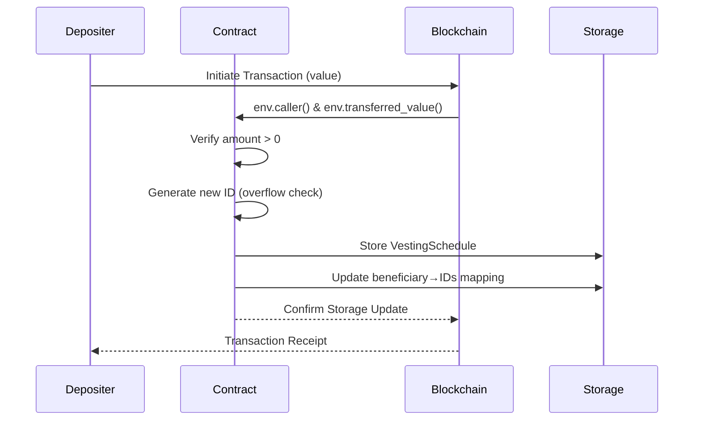
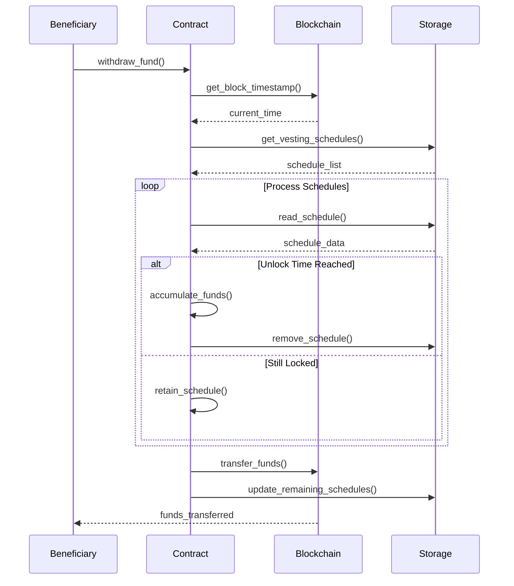

## A simple Vesting Smart Contract in Ink! for Polkadot

This Ink! smart contract enables an entity (e.g., an employer) to lock funds for a beneficiary (e.g., an employee) until a specified timestamp is reached. Funds can be deposited into multiple schedules and later withdrawn by the beneficiary once the unlock time occurs. Key features include:

- **Time-Locked Deposits**: Funds locked until specified timestamps
- **Multi-Beneficiary Support**: Manage multiple payment schedules
- **Transparent Tracking**: On-chain proof of committed funds
- **Secure Withdrawals**: Automated time-based release

### Time Calculation

When funds are deposited, an `unlock_time` (a UNIX timestamp) is recorded. During withdrawal, the contract reads the current block timestamp with `self.env().block_timestamp()`. If the current time equals or exceeds the unlock time, the funds are eligible for withdrawal.

- **Block Timestamp**: Each block contains creation time (milliseconds since UNIX epoch)
- **Deterministic Execution**: Contracts only access current block's timestamp
- **Reliability:**: Relying on the blockchain’s timestamp ensures that the schedule is enforced transparently and securely.

### Data Structures

The contract uses two primary storage mappings:

- **Schedules Mapping (ID to Schedule):** Each `VestingSchedule` holds the owner, beneficiary, deposited amount, and unlock time.
- **Beneficiary Lookup:** A mapping from beneficiary to a list of schedule IDs allows quick access to all vesting schedules associated with a given account.

An auto-incrementing `id` guarantees unique identifiers for each new schedule, with proper overflow checks.

| Component | Type | Purpose |
|-----------|------|---------|
| `id` | `u64` | Auto-incrementing schedule ID |
| `schedules` | `Mapping<u64, VestingSchedule>` | ID → Schedule lookup |
| `beneficiary_to_ids` | `Mapping<AccountId, Vec<u64>>` | Beneficiary → Schedule IDs |

## Core Functionality

### Deposit and Withdrawal Mechanics

#### Deposit Process (`deposit_fund`)

1. **Validate Deposit:**  
   - The caller provides funds (non-zero) along with the beneficiary and unlock time.
2. **Generate and Store Schedule:**  
   - A unique schedule ID is generated. A new vesting schedule is created and stored.
3. **Update Beneficiary Data:**  
   - The schedule ID is appended to the beneficiary’s list for future reference.

#### Withdrawal Process (`withdraw_fund`)

1. **Fetch Schedules:**  
   - The beneficiary calls the function, which retrieves all their schedule IDs.
2. **Check Unlock Conditions:**  
   - For each schedule, if `unlock_time` ≤ current block timestamp, its funds are aggregated and the schedule is removed.
3. **Transfer Funds:**  
   - If any funds are unlocked, they are transferred to the beneficiary; otherwise, an error is returned.

